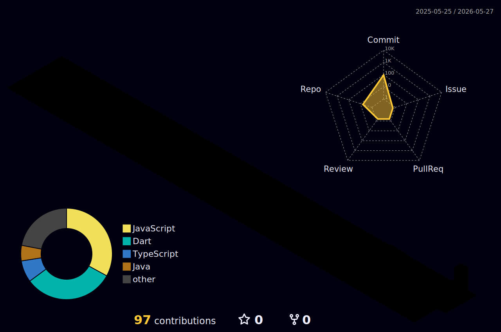

<!-- ═══════════════════════════════════════════════════════════════════════════ -->
<!--                          ✦  JOSHUA LUMACTOD  ✦                          -->
<!-- ═══════════════════════════════════════════════════════════════════════════ -->

<!-- HEADER BANNER -->

<!-- ANIMATED TYPING -->

 

<!-- PROFILE VIEWS + FOLLOWERS -->

&nbsp;

&nbsp;

 

<!-- ═══════════════════════════════════════════════════════════════════════════ -->
<!--                              ABOUT ME                                     -->
<!-- ═══════════════════════════════════════════════════════════════════════════ -->

##  &nbsp;About Me

<table border="0" width="100%">
  <tr border="0">
    <td width="55%" valign="top" border="0">
      <pre lang="yaml">
name: Joshua Lumactod
location: Pangasinan, Philippines 🇵🇭
education: BS Information Technology (2024 - Present)
role: Aspiring Developer & Student

currently_learning:
  - Flutter & Mobile Development
  - Backend Systems with PHP
  - UI/UX Design with Figma
  - React Native

interests:
  - Building practical applications
  - 3D Modeling & Design
  - Problem Solving
  - Open Source

hobbies: ["🎮 Gaming", "🍔 Foodie", "🔭 Tech Explorer"]
motto: "Turning ideas into real-world solutions"
      </pre>
    </td>
    <td width="45%" valign="middle" align="center" border="0">
      
    </td>
  </tr>
</table>

---

<!-- ═══════════════════════════════════════════════════════════════════════════ -->
<!--                            TECH STACK                                     -->
<!-- ═══════════════════════════════════════════════════════════════════════════ -->

## 🛠️ &nbsp;Tech Stack

### 🎨 Frontend

  
  
  
  
  
  

### ⚙️ Backend & Database

  
  
  
  
  

### 🎨 Design & Creative

  
  
  
  
  

### 🔧 Developer Tools

  
  
  
  
  

---

<!-- ═══════════════════════════════════════════════════════════════════════════ -->
<!--                          FEATURED PROJECTS                                -->
<!-- ═══════════════════════════════════════════════════════════════════════════ -->

## 🚀 &nbsp;Featured Projects

| 🎯 Project | 📝 Description | 🔧 Tech | 🔗 Link |
|:---:|:---:|:---:|:---:|
| **Portfolio Website** | Personal portfolio showcasing projects & skills | `HTML` `CSS` `JS` | [Live Demo](https://joshua-lumactod.vercel.app/) |
| **Whack-a-Mole** | Engaging mobile game with smooth touch controls | `Flutter` `Supabase` | [Play Now](https://whack-a-mole-theta-one.vercel.app) |
| **E-Commerce App** | Full-featured online store with cart & checkout | `Flutter` `Supabase` | Coming Soon |
| **3D Designs** | Creative 3D models for various purposes | `Blender` | Portfolio |

---

<!-- ═══════════════════════════════════════════════════════════════════════════ -->
<!--                           GITHUB STATS                                    -->
<!-- ═══════════════════════════════════════════════════════════════════════════ -->

## 📊 &nbsp;GitHub Stats

<!-- Streak Stats -->

  

<!-- 3D Contribution Graph -->

---

<!-- ═══════════════════════════════════════════════════════════════════════════ -->
<!--                         NOW PLAYING SPOTIFY                               -->
<!-- ═══════════════════════════════════════════════════════════════════════════ -->

## 🎧 &nbsp;Vibing To

---

<!-- ═══════════════════════════════════════════════════════════════════════════ -->
<!--                          CONNECT WITH ME                                  -->
<!-- ═══════════════════════════════════════════════════════════════════════════ -->

## 🌐 &nbsp;Connect With Me

&nbsp;

&nbsp;

&nbsp;

---

<!-- ═══════════════════════════════════════════════════════════════════════════ -->
<!--                           CONTRIBUTION SNAKE                              -->
<!-- ═══════════════════════════════════════════════════════════════════════════ -->

<picture>
  <source media="(prefers-color-scheme: dark)" srcset="https://raw.githubusercontent.com/Joshh181/Joshh181/output/github-snake-dark.svg" />
  <source media="(prefers-color-scheme: light)" srcset="https://raw.githubusercontent.com/Joshh181/Joshh181/output/github-snake.svg" />
  
</picture>

 

<!-- ═══════════════════════════════════════════════════════════════════════════ -->

